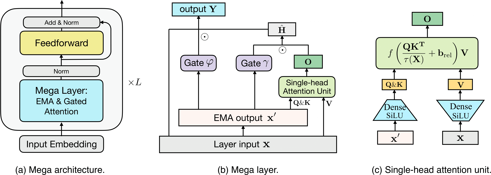

<h1 align="center">Mega: Moving Average Equipped Gated Attention</h1>

This is the PyTorch implementation of the Mega paper. This folder is based on the [fairseq package v0.9.0](https://github.com/pytorch/fairseq/tree/v0.9.0). 

<p align="center">
 
</p>

>[Mega: Moving Average Equipped Gated Attention](https://arxiv.org/abs/2209.10655)

>Xuezhe Ma*, Chunting Zhou*, Xiang Kong, Junxian He, Liangke Gui, Graham Neubig, Jonathan May, Luke Zettlemoyer

## Updates
1. [Oct 17th 2022] `--fp16` training has been supported.
2. [Jan 10th 2023] Release [Mega Image](https://github.com/XuezheMax/mega-image).
3. [Jan 28th 2023] Release checkpoints of WMT'16 English to German.

## Setup
This repository requires Python 3.8+ and Pytorch 1.11+.

```bash
# Install from this repo
pip install -e .
```
For faster training, install NVIDIA's apex library following [fairseq](https://github.com/facebookresearch/fairseq#requirements-and-installation).

## Examples

[//]: # (* [Mega: Moving Average Equipped Gated Attention]&#40;https://github.com/XuezheMax/fairseq-apollo/tree/master/examples/mega&#41;)


### Models Checkpoints
Task | Description                          | # params | Download
---|--------------------------------------|---|---
`LRA` | Mega on LRA tasks                    | -- | [mega.lra.zip](https://dl.fbaipublicfiles.com/mega/mega.lra.zip)
`WMT'16 (En-De)` | Mega-base on WMT'16 En-De            | 67M | [mega.wmt16ende.base.zip]()
`WMT'16 (De-En)` | Mega-base on WMT'16 De-En            | 67M | [mega.wmt16deen.base.zip]()
`SC-Raw` | Mega-base/big on raw Speech Commands | 300k | [mega.sc.zip](https://dl.fbaipublicfiles.com/mega/mega.sc.zip)
`WikiText-103` | Language modeling on WikiText-103    | 252M |[mega.wiki103.zip](https://dl.fbaipublicfiles.com/mega/wt103.zip)
`Enwiki8` | Language modeling on Enwiki8         | 39M | [mega.enwiki8.zip](https://dl.fbaipublicfiles.com/mega/enwik8.zip)


### Experiments

- [Long Range Arena](examples/mega/README.lra.md)
- [Machine Translation](examples/mega/README.mt.md)
- [Speech Classification](examples/mega/README.sc.md)
- [Language Modeling](examples/mega/README.lm.md)
- [ImageNet](https://github.com/XuezheMax/mega-image)


## Code Overview
1. Mega layer is implemented in [fairseq/modules/mega_layer.py](https://github.com/facebookresearch/mega/blob/main/fairseq/modules/mega_layer.py).
2. Mega encoder (LRA) is implemented in [fairseq/models/lra/mega_lra_encoder.py](https://github.com/facebookresearch/mega/blob/main/fairseq/models/lra/mega_lra_encoder.py).
3. Mega decoder (LM) is implemented in [fairseq/models/mega_lm.py](https://github.com/facebookresearch/mega/blob/main/fairseq/models/mega_lm.py).
4. Mega encoder-decoder (NMT) is implemented in [fairseq/models/mega.py](https://github.com/facebookresearch/mega/blob/main/fairseq/models/mega.py).

## Tips
1. The released model checkpoints were trained with float32.
2. When training Mega, please note the following hyperparamters that decide the size of the model. `--encoder/decoder-embed-dim` is the input embedding dimension. `--encoder/decoder-hidden-dim` is the expanding dimension of value vectors of attention. `--encoder/decoder-ffn-embed-dim` is the FFN intermediate dimension. `--encoder/decoder-hidden-dim` and `--encoder/decoder-ffn-embed-dim` is usually the same. **To obtain similar number of parameters as Transformers, they are usually set to be 2 times `--encoder/decoder-embed-dim`**. `--encoder/decoder-z-dim` is the shrinking dimension of the query/key vectors of attention, which is usually set to be 128 or 1/4 of `--encoder/decoder-embed-dim`.
3. If you'd like to apply Mega to your task/data, besides architecture size, hyperparameters that are worth considering and tuning include learning rate (lr) and weight decay (wd). We find that tuning wd is a more effective regularization to Mega (in contrast to tuning dropout rates for Transformers).
Suggested wd values include `0.01, 0.05, 0.1` (larger models typically need larger wd, please refer to appendix of our paper for hyperparameters we have used). For lr scheduler, linear lr decay and cosine lr decay schedules are more effective than the inverse square root decay scheduler for Mega.

## License
mega is under MIT license. The license applies to model checkpoints as well.

## Citation

```bibtex
@article{ma2022mega,
  title={Mega: Moving Average Equipped Gated Attention},
  author={Ma, Xuezhe and Zhou, Chunting and Kong, Xiang and He, Junxian and Gui, Liangke and Neubig, Graham and May, Jonathan and Zettlemoyer Luke},
  journal={arXiv preprint arXiv:2209.10655},
  year={2022}
}
```
